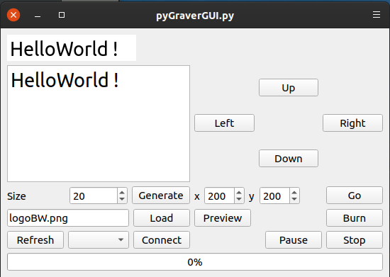

# pyGraver
 Simple python tool for NEJE laser engravers.

## Status

Tested on NEJE DK-8-KZ (buy on 2020)

## Graphical user interface

Allow to :
* Choose COM port and connect to engraver device
* Move engraver head
* Load image from file
* Create an image from text
* Upload image and show position on engraver
* Burn image

## Command-Line Interface

TODO

## TODO

- [ ] change print output to logging output
- [ ] add command-line interface
- [ ] GUI : set burning time

## Inspired from

https://github.com/camrein/EzGraver

https://github.com/anabolyc/neje-engraver-tool
